# AWS Auto Scaling Web Application Infrastructure

This Terraform project deploys a highly available, scalable web application infrastructure on AWS with an Application Load Balancer, Auto Scaling Group, and secure network architecture.

## Architecture Overview

```
Internet
    |
    v
┌─────────────────────────────────────────────────────────────┐
│                        VPC (192.168.0.0/16)                │
│                                                             │
│  ┌─────────────────┐              ┌─────────────────┐      │
│  │  Public Subnet  │              │  Public Subnet  │      │
│  │   us-east-1a    │              │   us-east-1b    │      │
│  │ 192.168.3.0/24  │              │ 192.168.4.0/24  │      │
│  │                 │              │                 │      │
│  │  ┌───────────┐  │              │                 │      │
│  │  │  Bastion  │  │              │                 │      │
│  │  │   Host    │  │              │                 │      │
│  │  └───────────┘  │              │                 │      │
│  │                 │              │                 │      │
│  │     ALB (Application Load Balancer)              │      │
│  │         ┌─────────────────────────────┐          │      │
│  └─────────┼─────────────────────────────┼──────────┘      │
│            │                             │                 │
│            v                             v                 │
│  ┌─────────────────┐              ┌─────────────────┐      │
│  │ Private Subnet  │              │ Private Subnet  │      │
│  │   us-east-1a    │              │   us-east-1b    │      │
│  │ 192.168.1.0/24  │              │ 192.168.2.0/24  │      │
│  │                 │              │                 │      │
│  │  ┌───────────┐  │              │  ┌───────────┐  │      │
│  │  │   EC2     │  │              │  │   EC2     │  │      │
│  │  │  (Nginx)  │  │              │  │  (Nginx)  │  │      │
│  │  └───────────┘  │              │  └───────────┘  │      │
│  │                 │              │                 │      │
│  │  ┌───────────┐  │              │                 │      │
│  │  │    NAT    │  │              │                 │      │
│  │  │  Gateway  │  │              │                 │      │
│  │  └───────────┘  │              │                 │      │
│  └─────────────────┘              └─────────────────┘      │
└─────────────────────────────────────────────────────────────┘
```



## Features

- **High Availability**: Multi-AZ deployment across us-east-1a and us-east-1b
- **Auto Scaling**: Automatically scales between 1-3 instances based on demand
- **Load Balancing**: Application Load Balancer distributes traffic across instances
- **Security**: Layered security with separate security groups and private subnets
- **Bastion Access**: Secure SSH access through bastion host
- **Internet Access**: NAT Gateway for private subnet internet access

## Infrastructure Components

### Networking
- **VPC**: Custom VPC with CIDR 192.168.0.0/16
- **Public Subnets**: 2 subnets for ALB and bastion host
- **Private Subnets**: 2 subnets for web servers
- **Internet Gateway**: Internet access for public subnets
- **NAT Gateway**: Outbound internet access for private subnets

### Compute
- **Auto Scaling Group**: 1-3 t2.micro instances running Nginx
- **Launch Template**: Standardized EC2 configuration
- **Bastion Host**: Secure SSH access point

### Load Balancing
- **Application Load Balancer**: Layer 7 load balancer
- **Target Group**: Health checks and traffic distribution
- **Listener**: HTTP traffic on port 80

### Security
- **ALB Security Group**: HTTP/HTTPS from internet
- **Web Server Security Group**: HTTP from ALB, SSH from bastion
- **Bastion Security Group**: SSH from internet

## Prerequisites

- AWS CLI configured with appropriate credentials
- Terraform >= 1.0
- SSH key pair for EC2 access

## Deployment

1. **Clone and navigate to project**:
   ```bash
   cd /home/maro/tf2
   ```

2. **Generate SSH key pair**:
   ```bash
   ssh-keygen
   ```

3. **Initialize Terraform**:
   ```bash
   terraform init
   ```

3. **Review the plan**:
   ```bash
   terraform plan
   ```

4. **Deploy infrastructure**:
   ```bash
   terraform apply
   ```

5. **Get ALB DNS name**:
   ```bash
   terraform output alb_dns_name
   ```

## Configuration

### Variables
- `instance_type`: EC2 instance type (default: t2.micro)
- `asg_key_name`: SSH key name for EC2 instances

### User Data Script
The `scripts/user_data.sh` installs and configures Nginx on each instance.

## Security Best Practices

- ✅ Web servers in private subnets
- ✅ Separate security groups for each tier
- ✅ Bastion host for secure SSH access
- ✅ ALB only accepts HTTP/HTTPS traffic
- ✅ Web servers only accept traffic from ALB
- ✅ SSH access only through bastion host

## Accessing the Application

1. **Web Application**: Use the ALB DNS name from terraform output
2. **SSH to Instances**: 
   ```bash
   # First connect to bastion
   ssh -i bastion-key ec2-user@<bastion-public-ip>
   
   # Then connect to private instances
   ssh ec2-user@<private-instance-ip>
   ```

## Monitoring and Maintenance

- **Health Checks**: ALB performs health checks on `/` endpoint
- **Auto Scaling**: Monitors CPU and scales automatically
- **Logs**: Check CloudWatch logs for application and system metrics

## Cleanup

To destroy all resources:
```bash
terraform destroy
```

## File Structure

```
ha-aws-app/
├── README.md                 # This file
├── provider.tf              # AWS provider configuration
├── vpc.tf                   # VPC configuration
├── subnet.tf                # Subnet definitions
├── internet_gateway.tf      # Internet gateway
├── nat_gateway.tf           # NAT gateway
├── route_table.tf           # Route tables
├── security_groups.tf       # Security group rules
├── load_balancer.tf         # ALB configuration
├── autoscaling_group.tf     # ASG and launch template
├── bastion.tf               # Bastion host
├── iam.tf                   # IAM roles and policies
├── s3.tf                    # S3 bucket
├── outputs.tf               # Output values
├── variables.tf             # Input variables
├── data.tf                  # Data sources
├── scripts/
│   └── user_data.sh         # EC2 initialization script
└── policies/
    └── ec2_policy.json      # IAM policy document
```

## Troubleshooting

### Common Issues

1. **ALB Timeout**: Ensure ALB is in public subnets
2. **Health Check Failures**: Verify Nginx is running and responding on port 80
3. **SSH Access**: Use bastion host to access private instances
4. **Security Groups**: Check that security group rules allow required traffic

### Useful Commands

```bash
# Check ALB status
aws elbv2 describe-load-balancers --names Application-LoadBalancer

# Check target health
aws elbv2 describe-target-health --target-group-arn <target-group-arn>

# Check auto scaling group
aws autoscaling describe-auto-scaling-groups --auto-scaling-group-names AutoScalingGroup
```

## Cost Optimization

- Uses t2.micro instances (free tier eligible)
- Single NAT Gateway (consider one per AZ for production)
- Auto scaling prevents over-provisioning

## Next Steps

- Add SSL certificate for HTTPS
- Implement CloudWatch monitoring and alarms
- Add RDS database for dynamic content
- Configure WAF for additional security
- Set up CI/CD pipeline for deployments
